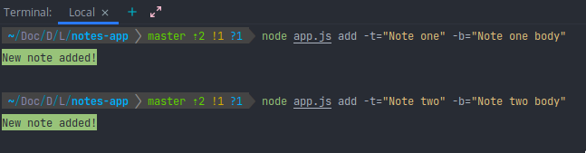
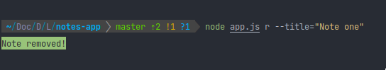

# notes-app
A command line note taken application built in NodeJs...

# Requirements
You must have NodeJs installed to run this program and npm to install necessary package

# Getting Started
cloning and setup the repository using :
```bash
git clone <link https or ssh of the repo>

cd notes-app

npm install
```
> These commands above will clone the program to your local machine and move inside the project directory, and install the necessary package, if no error found you are ready to start using it 😎
## Usage
```bash
node app.js command <option1> [value1] <option2> [value2]
```
> You can also use aliases, run ```command <option> --help for more```

### Run these commands right inside the root of project directory

# To add a new note
## The add command
```bash
node app.js add <title> [value] <body> [value]

or 

node app.js a <t> [value] <b> [value]
``` 
### Example
```bash
node app.js add --title="Note One" --body="Note one body"

or

node app.js a -t="Note one" -b="Note one body"
```
### Screenshot


# To remove a note
## The remove command
```bash
node app.js remove <title> [value]

or 

node app.js r <t> [value]
```
### Example
```bash
node app.js remove --title="Note one"

or 

node app.js r -t="Note one"
```

# To list your notes
## The list command
```bash
node app.js list

or 

node app.js l
```


# To read a note
### The read command
```bash
node app.js read <title> [value]
```

### Example
```bash
node app.js read --title="Note one"

or 

node app.js R --title="Note one"

or

node app.js R -t="Note one"
```

# To clear all your notes
### The clear command
```bash
node app.js clear

or 

node app.js c
```


## For help
```bash
node app.js --help
```

...


